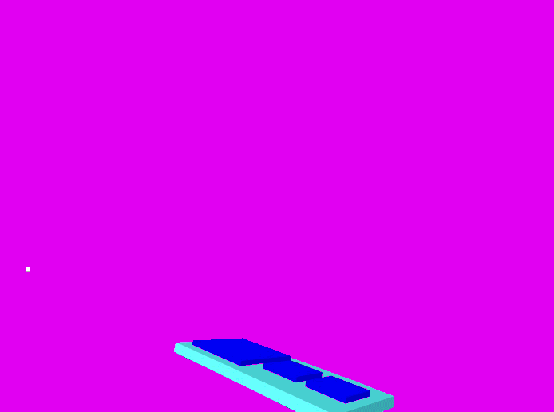

*Note: this is a brand spankin' new project. Would love feedback in the form of issues and pull requests :) Hope some folks find this useful.*

# Dayframe
A boilerplate project to use their smartphoens to simulate the Daydream remote in aframe projects, using websockets.

This is meant to help designers quickly create prototypes for Google's Daydream platform using Mozilla's excellent Aframe project.

Steps to view the live demo:

1. Go to this URL on your computer: https://dayframe-demo.herokuapp.com/scene
2. Go to this URL with your smartphone: https://dayframe-demo.herokuapp.com/remote

Note: only one person at a time can control the remote. If you join, you will disconnect the previously connected remote.

# Usage

Before you start, make sure you've got Node and npm installed on your system.

## Setup

1. Clone the repository.
2. Run `npm install`.
3. Run `npm start` to start the server on port 3000.
4. (optional) `npm run dev` to launch browsersync dev workflow on port 3001 with live reloading enabled.

## Getting started

There are two URLs of interest to you:

1. `http://localhost:3000/remote` which is what you will navigate to on your remote device.
2. `http://localhost:3000/scene` which is where your Aframe scene will live.

Out of the box, the demo scene provided is a virtual version of the remote app.
It will show you visual feedback of the events being transmitted by your remote device.

## Supported Events

These are a list of events you can listen for in your scene. The events can be subscribed to as follows:

    socket.on('remote:connected', function(evt) {
      console.log('A remoted has connected to the scene',evt);
    })

### Remote events
+ `remote:connected` - when a remote connected to the scene
+ `remote:disconnected` - when a remote disconnects from the scene

### Orientation events
+ `orientation:change` - provides the current `{x, y, z}` rotation coordinates of the remote device.

### Button events
+ `trackpad:touchstart` - when the user's finger initially touches the trackpad
+ `trackpad:touchmove` - when the user's finger moves on the trackpad, provides the `{x, y}` coordinates of the current finger position as percentages.
+ `trackpad:touchend` - when the user's finger leaves the trackpad
+ `trackpad:click` - as per the official Daydream remote emulator, the click is triggered by a double tap on the trackpad.
+ `app:tap` - a tap of the app button
+ `home:tap` - a tap of the home button
